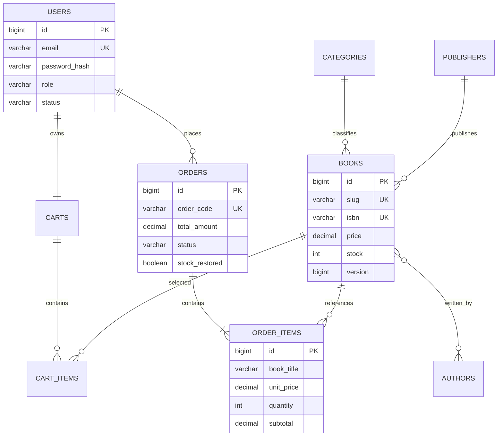

# Yukihira Bookstore

Website bán sách dạng modular monolith, xây dựng bằng Java 21, Spring Boot 4.1.1, Spring MVC, Thymeleaf, Spring Security, Spring Data JPA, Flyway và Supabase PostgreSQL.

## Chức năng

- Khách: xem, tìm kiếm, lọc, sắp xếp và phân trang sách.
- Thành viên: đăng ký, đăng nhập, sửa hồ sơ, quản lý giỏ, checkout, xem và hủy đơn hợp lệ.
- Quản trị: CRUD catalog, xử lý trạng thái đơn, khóa/mở tài khoản khách, xem doanh thu và sách bán chạy.
- Checkout an toàn: khóa bi quan từng sách, đọc lại giá/tồn kho, tạo snapshot OrderItem, trừ kho và xóa giỏ trong cùng transaction.
- Bảo mật: BCrypt, session login, CSRF, phân quyền URL và kiểm tra ownership tại service.

## Kiến trúc

```text
Browser
  -> Spring Security
  -> Spring MVC Controller + Form DTO + Validation
  -> Application Service + Transaction + Business Policy
  -> Spring Data Repository + Specification
  -> Hibernate / Flyway
  -> Supabase PostgreSQL
```

Source được chia theo feature: `auth`, `user`, `book`, `cart`, `order`, `admin` thay vì gom toàn bộ controller/service/repository vào các package kỹ thuật lớn.

Các pattern chính:

- MVC và Layered Architecture cho luồng web.
- Repository và Dependency Injection cho truy cập dữ liệu.
- DTO/Mapper để form không bind trực tiếp vào entity quan trọng.
- Specification cho bộ lọc động.
- Facade ở `ReferenceDataService` cho dữ liệu tham chiếu admin.
- State-like Policy ở `OrderTransitionPolicy` cho vòng đời đơn.
- Snapshot Pattern ở `OrderItem` để giữ tên và giá lịch sử.

## ERD



## Yêu cầu môi trường

- JDK 21 trở lên. Máy phát triển hiện tại đã xác nhận chạy bằng Java 26.
- Maven 3.6.3 trở lên. Máy phát triển hiện tại dùng Maven 3.9.16.
- Supabase PostgreSQL project hoặc PostgreSQL tương thích.
- Không bắt buộc cài `psql` hay Docker để chạy ứng dụng.

## Biến môi trường

File thật nằm tại `btlJava/.env` và đã được `.gitignore` loại khỏi source control. Không đặt secret trong `application.yml`, HTML, JavaScript hoặc commit Git.

```dotenv
DATABASE_URL=jdbc:postgresql://<host>:5432/postgres?sslmode=require
DATABASE_USERNAME=postgres
DATABASE_PASSWORD=<database-password>
ADMIN_EMAIL=<your-admin-email>
ADMIN_PASSWORD=<strong-admin-password>
APP_SEED_DEMO=false
```

`SUPABASE_URL`, publishable key và secret key không được ứng dụng hiện tại sử dụng vì backend kết nối trực tiếp bằng JDBC. Chỉ thêm chúng khi triển khai một tính năng Supabase API hoặc Storage cụ thể; secret key tuyệt đối không đưa ra frontend.

Tài khoản admin được tạo một lần khi cả `ADMIN_EMAIL` và `ADMIN_PASSWORD` có giá trị. Không có mật khẩu admin mặc định. Đặt `APP_SEED_DEMO=true` hoặc dùng `-SeedDemo` để thêm sáu sách mẫu khi bảng sách đang trống.

## Chạy ứng dụng

Từ `btlJava/yukihira-bookstore` trên PowerShell:

```powershell
.\scripts\run-dev.ps1
```

Chạy lần đầu với catalog mẫu:

```powershell
.\scripts\run-dev.ps1 -SeedDemo
```

Script đọc `btlJava/.env` vào process hiện tại mà không in giá trị bí mật. Flyway tự chạy migration trong `src/main/resources/db/migration` trước khi Hibernate validate schema.

Nếu đã khai báo biến môi trường ở hệ điều hành, có thể chạy trực tiếp:

```powershell
mvn spring-boot:run
```

Ứng dụng mở tại `http://localhost:8080`.

## Kiểm thử

```powershell
mvn test
mvn clean verify
```

Suite hiện có 22 test bao phủ context, Flyway trên schema trống, mapping JPA, đăng ký/BCrypt, security URL, catalog, giỏ hàng, checkout, rollback thiếu kho, ownership đơn, transition, hoàn kho một lần, hồ sơ và báo cáo.

Luồng tích hợp đã kiểm tra với Supabase thật:

```text
home -> register -> login -> book detail -> add cart -> checkout -> order detail
```

## Route chính

| Khu vực | Route |
|---|---|
| Public | `/`, `/books`, `/books/{slug}`, `/register`, `/login` |
| Thành viên | `/profile`, `/cart`, `/checkout`, `/orders`, `/orders/{id}` |
| Quản trị | `/admin`, `/admin/books`, `/admin/categories`, `/admin/authors`, `/admin/publishers` |
| Quản trị | `/admin/orders`, `/admin/users`, `/admin/reports` |

## Quy tắc đơn hàng

```text
PENDING -> CONFIRMED -> SHIPPING -> COMPLETED
   |           |
   +-----------+-> CANCELLED
```

Khách chỉ hủy đơn `PENDING`. Admin chỉ chọn transition được policy cho phép. Khi chuyển sang `CANCELLED`, tồn kho được hoàn đúng một lần qua cờ `stock_restored`; `COMPLETED` và `CANCELLED` là trạng thái kết thúc.

## Cấu trúc quan trọng

```text
src/main/java/com/yukihira/bookstore
├── auth, security, user
├── category, author, publisher, book
├── cart, order
├── admin/catalog, admin/order, admin/report, admin/user
├── common, config, home
src/main/resources
├── db/migration
├── templates
└── static/css
```
