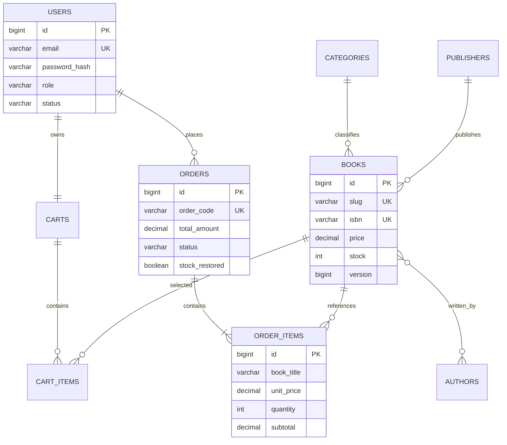

# Yukihira Bookstore

Website bán sách dạng modular monolith, xây dựng bằng Java 21, Spring Boot 4.1.1, Spring MVC, Thymeleaf, Spring Security, Spring Data JPA, Flyway và Supabase PostgreSQL.

## Chức năng

- Khách: xem, tìm kiếm, lọc, sắp xếp và phân trang sách.
- Thành viên: đăng ký, đăng nhập, sửa hồ sơ, quản lý giỏ, checkout, xem và hủy đơn hợp lệ.
- Quản trị: CRUD catalog, xử lý trạng thái đơn, khóa/mở tài khoản khách, xem doanh thu và sách bán chạy.
- Checkout an toàn: khóa bi quan từng sách, đọc lại giá/tồn kho, tạo snapshot OrderItem, trừ kho và xóa giỏ trong cùng transaction.
- Bảo mật: BCrypt, session login, CSRF, phân quyền URL và kiểm tra ownership tại service.

### Trang quản trị

- Layout riêng: sidebar, menu mobile, bộ lọc/phân trang, thông báo lỗi và hộp xác nhận thao tác.
- Sách: thêm, xem, sửa, xóa; quản lý ISBN, slug, thể loại, nhiều tác giả, nhà xuất bản, URL ảnh bìa, giá và trạng thái.
- Thể loại/tác giả/nhà xuất bản: tạo, sửa, tìm kiếm, phân trang và xóa theo ràng buộc liên kết.
- Tồn kho: cập nhật số cuốn thực tế, lọc sắp hết/hết hàng, tự chuyển trạng thái theo số lượng. Kiểm tra phiên bản ngăn tab cũ ghi đè dữ liệu mới.
- Đơn hàng: tìm theo mã/khách, lọc trạng thái/khoảng ngày, chi tiết, chuyển bước hợp lệ, in phiếu.
- Khách hàng: hồ sơ, lịch sử đơn, khóa/mở khóa. Khóa có hiệu lực với phiên đang mở ở lần truy cập tiếp theo; không cấp quyền admin hoặc xóa lịch sử từ màn hình này.
- Dashboard/báo cáo: đơn chờ, doanh thu hoàn thành, sách đang bán, khách hàng, cảnh báo tồn kho và top 10 sách bán chạy theo kỳ. Khoảng ngày tính theo **ngày đặt hàng**, múi giờ Việt Nam.

Xóa an toàn: sách có trong đơn hoặc giỏ được **ngừng bán**; thể loại có sách được **ẩn**; tác giả/NXB đang liên kết bị từ chối xóa. Tên và giá trong đơn cũ không thay đổi khi sửa sách.

## Kiến trúc

```text
Browser
  -> Spring Security
  -> Spring MVC Controller + Form DTO + Validation
  -> Application Service + Transaction + Business Policy
  -> Spring Data Repository + Specification
  -> Hibernate / Flyway
  -> Supabase PostgreSQL
```

Source được chia theo feature: `auth`, `user`, `book`, `cart`, `order`, `admin` thay vì gom toàn bộ controller/service/repository vào các package kỹ thuật lớn.

Các pattern chính:

- MVC và Layered Architecture cho luồng web.
- Repository và Dependency Injection cho truy cập dữ liệu.
- DTO/Mapper để form không bind trực tiếp vào entity quan trọng.
- Specification cho bộ lọc động.
- Facade ở `ReferenceDataService` cho dữ liệu tham chiếu admin.
- State-like Policy ở `OrderTransitionPolicy` cho vòng đời đơn.
- Snapshot Pattern ở `OrderItem` để giữ tên và giá lịch sử.

## ERD


```mermaid
erDiagram
    USERS ||--|| CARTS : owns
    USERS ||--o{ ORDERS : places
    CARTS ||--o{ CART_ITEMS : contains
    BOOKS ||--o{ CART_ITEMS : selected
    ORDERS ||--|{ ORDER_ITEMS : contains
    BOOKS ||--o{ ORDER_ITEMS : references
    CATEGORIES ||--o{ BOOKS : classifies
    PUBLISHERS ||--o{ BOOKS : publishes
    BOOKS }o--o{ AUTHORS : written_by

    USERS {
      bigint id PK
      varchar email UK
      varchar password_hash
      varchar role
      varchar status
    }
    BOOKS {
      bigint id PK
      varchar slug UK
      varchar isbn UK
      decimal price
      int stock
      bigint version
    }
    ORDERS {
      bigint id PK
      varchar order_code UK
      decimal total_amount
      varchar status
      boolean stock_restored
    }
    ORDER_ITEMS {
      bigint id PK
      varchar book_title
      decimal unit_price
      int quantity
      decimal subtotal
    }
```

## Yêu cầu môi trường

- JDK 21 trở lên. Máy phát triển hiện tại đã xác nhận chạy bằng Java 26.
- Maven 3.6.3 trở lên. Máy phát triển hiện tại dùng Maven 3.9.16.
- Supabase PostgreSQL project hoặc PostgreSQL tương thích.
- Không bắt buộc cài `psql` hay Docker để chạy ứng dụng.

## Biến môi trường

File thật nằm tại `btlJava/.env` và đã được `.gitignore` loại khỏi source control. Không đặt secret trong `application.yml`, HTML, JavaScript hoặc commit Git.

```dotenv
DATABASE_URL=jdbc:postgresql://<transaction-pooler-host>:6543/postgres?pgbouncer=true&prepareThreshold=0&sslmode=require
DIRECT_URL=jdbc:postgresql://<session-pooler-host>:5432/postgres?sslmode=require
DATABASE_USERNAME=postgres
DATABASE_PASSWORD=<database-password>
ADMIN_EMAIL=<your-admin-email>
ADMIN_PASSWORD=<strong-admin-password>
APP_SEED_DEMO=false
```

`SUPABASE_URL`, publishable key và secret key không được ứng dụng hiện tại sử dụng vì backend kết nối trực tiếp bằng JDBC. Chỉ thêm chúng khi triển khai một tính năng Supabase API hoặc Storage cụ thể; secret key tuyệt đối không đưa ra frontend.

Tài khoản admin được tạo một lần khi cả `ADMIN_EMAIL` và `ADMIN_PASSWORD` có giá trị. Không có mật khẩu admin mặc định. Đặt `APP_SEED_DEMO=true` hoặc dùng `-SeedDemo` để thêm sáu sách mẫu khi bảng sách đang trống.

## Chạy ứng dụng

Từ `btlJava/yukihira-bookstore` trên PowerShell:

```powershell
.\scripts\run-dev.ps1
```

Chạy lần đầu với catalog mẫu:

```powershell
.\scripts\run-dev.ps1 -SeedDemo
```

Script đọc `btlJava/.env` vào process hiện tại mà không in giá trị bí mật. Flyway tự chạy migration trong `src/main/resources/db/migration` trước khi Hibernate validate schema.

Nếu đã khai báo biến môi trường ở hệ điều hành, có thể chạy trực tiếp:

```powershell
mvn spring-boot:run
```

Ứng dụng mở tại `http://localhost:8080`.

Nếu cổng 8080 đang được dùng, chạy cổng 8081:

```powershell
$env:SERVER_PORT = '8081'
powershell -ExecutionPolicy Bypass -File .\scripts\run-dev.ps1
```

Vào `http://localhost:8081/login`. Tài khoản có role `ADMIN` được chuyển đến `/admin` sau đăng nhập (hoặc trở lại trang đã yêu cầu trước đó).

## Kiểm thử

```powershell
mvn test
mvn clean verify
```

Suite hiện có **47 test** dùng H2 độc lập với `.env`/Supabase: context, Flyway trên schema trống, mapping, BCrypt, phân quyền/CSRF, form CRUD admin, ISBN/slug/giá/liên kết, chống ghi đè tab cũ, giỏ hàng, checkout, rollback, ownership, chuyển trạng thái, hủy đồng thời chỉ hoàn kho một lần, khóa phiên khách và báo cáo theo ngày.

Chi tiết kết quả: [docs/ADMIN_VERIFICATION.md](docs/ADMIN_VERIFICATION.md).

Để thử CRUD không đụng dữ liệu thật, mở **PowerShell mới** tại thư mục project, đặt tài khoản thử rồi chạy H2 tạm:

```powershell
$env:ADMIN_EMAIL = 'qa-admin@example.test'
$env:ADMIN_PASSWORD = '<mat-khau-thu-rieng-it-nhat-12-ky-tu>'
$env:APP_SEED_DEMO = 'true'
$env:SERVER_PORT = '8082'
$env:SERVER_ADDRESS = '127.0.0.1'
$env:SPRING_PROFILES_ACTIVE = 'test'
$env:SPRING_CONFIG_ADDITIONAL_LOCATION = 'file:./src/test/resources/'
mvn '-Dspring-boot.run.useTestClasspath=true' spring-boot:run
```

Không chạy `run-dev.ps1` trong cửa sổ QA này. `useTestClasspath` cung cấp H2; `SPRING_CONFIG_ADDITIONAL_LOCATION` nạp cấu hình test. Dữ liệu thử chỉ ở RAM và mất khi dừng server. Đóng cửa sổ QA trước khi chạy Supabase trong cửa sổ khác.

Luồng tích hợp đã kiểm tra với Supabase thật:

```text
home -> register -> login -> book detail -> add cart -> checkout -> order detail
```

## Route chính

| Khu vực | Route |
|---|---|
| Public | `/`, `/books`, `/books/{slug}`, `/register`, `/login` |
| Thành viên | `/profile`, `/cart`, `/checkout`, `/orders`, `/orders/{id}` |
| Quản trị | `/admin`, `/admin/books`, `/admin/categories`, `/admin/authors`, `/admin/publishers` |
| Quản trị | `/admin/inventory`, `/admin/orders`, `/admin/users`, `/admin/reports` |
| Chi tiết admin | `/admin/books/{id}`, `/admin/books/{id}/edit`, `/admin/orders/{id}`, `/admin/users/{id}` |

## Quy tắc đơn hàng

```text
PENDING -> CONFIRMED -> SHIPPING -> COMPLETED
   |           |
   +-----------+-> CANCELLED
```

Khách chỉ hủy đơn `PENDING`. Admin chỉ chọn transition được policy cho phép. Khi chuyển sang `CANCELLED`, tồn kho được hoàn đúng một lần qua cờ `stock_restored`; `COMPLETED` và `CANCELLED` là trạng thái kết thúc.

## Cấu trúc quan trọng

```text
src/main/java/com/yukihira/bookstore
├── auth, security, user
├── category, author, publisher, book
├── cart, order
├── admin/catalog, admin/order, admin/report, admin/user
├── common, config, home
src/main/resources
├── db/migration
├── templates
└── static/css, static/js
```
